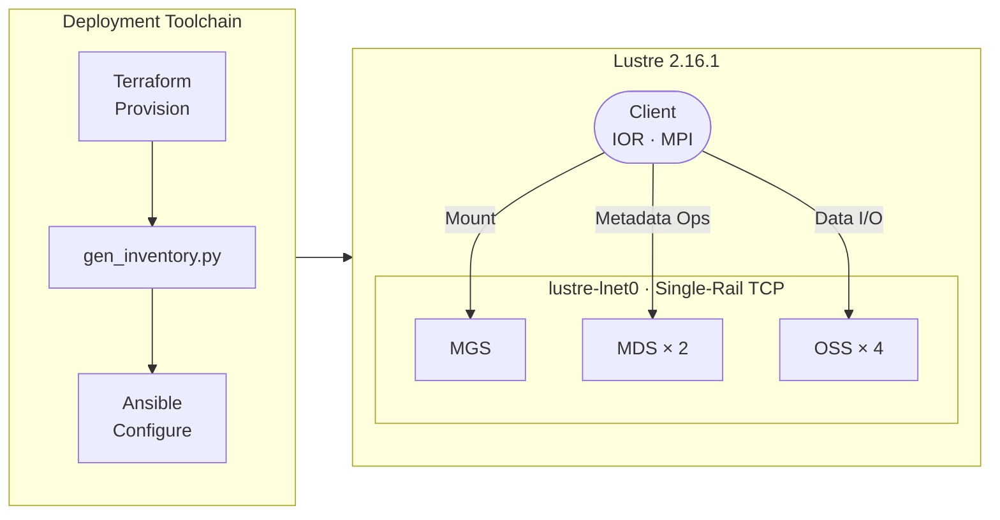

# lustre-local-sandbox

A repeatable KVM-based runbook and tools to build a Lustre parallel filesystem cluster,
with Ansible configuration and Terraform infrastructure provisioning for
multiple nodes per role.

This sandbox is intended as a portfolio demo for building and automating
storage technology stacks from scratch. It provides a 'run on your laptop'
stack for a multi-node 2.16.1 Lustre file system using ldiskfs. It is not set up
as a development environment for building Lustre code.

## Building the Cluster
See [docs/runbook.md](docs/runbook.md) for the full deployment walkthrough.
Read [Prerequisites](#prerequisites) and [Setup](#setup) before executing
the runbook to fully prepare your VM host.

## Sandbox Environment



**Default cluster topology:** 1 client, 1 MGS, 2 MDS, 4 OSS
* VMs have 2 vCPUs, a 20GiB boot disk, a management and LNET virtual network adapter.
* All servers have a 5GiB disk for Lustre.
* The mgs and oss nodes have 2GiB of memory, client and mds 4GiB.

This means the _total reservations_ of default VMs are:
* 16 VCPUs = (8 * 2 VCPUs)
* 200 GiB Disk = (8 * 20GiB) + (7 * 5GiB) + 5GiB additional reserved space
* 22 GiB Memory = (5 * 2GiB) + (3 * 4GiB)

If these reservations do not work for your KVM host, nodes may manually be reduced
down as low as one per role. Specific steps are not documented for modifying server
count but [Runbook Client Scaling](docs/runbook.md#scaling-the-client-pool) steps
can be adapted per environment needs.

### Configuration Notes

* All images are Rocky Linux 9.4 cloud image VMs, compatible with prebuilt Whamcloud RPMs.
* Given a virtualized environment (and stability concerns), single rail LNET.

---

## Prerequisites

The following must be installed on the KVM host before starting:

| Tool | Minimum version | Notes |
|------|----------------|-------|
| KVM / libvirt | — | `libvirtd` must be running; user must be in the `libvirt` group |
| Terraform | >= 1.6 | [install guide](https://developer.hashicorp.com/terraform/install) |
| Python | >= 3.9 | |
| git | — | |
| SSH keypair | ed25519 | `~/.ssh/id_ed25519.pub` injected into VMs by Terraform; override path in `terraform.tfvars` if needed |

### Distribution notes

**Ubuntu / Debian:** The following additional steps are required before setup.

Install packages not present by default:

```bash
sudo apt install python3-venv genisoimage
```

Ensure your user is in the `libvirt` group and the session has picked it up:

```bash
sudo usermod -aG libvirt $USER
# Log out and back in, or: newgrp libvirt
```

The default AppArmor profile for `libvirt-qemu` does not cover the custom pool
path used by this project. Grant access before running `terraform apply`:

```bash
echo '/var/lib/libvirt/lustre-demo/** rwk,' | \
  sudo tee /etc/apparmor.d/local/abstractions/libvirt-qemu
sudo apparmor_parser -r /etc/apparmor.d/abstractions/libvirt-qemu
```

**RHEL / Fedora:** Not yet validated. Expected to work with minor adjustments
to package names and SELinux configuration. Treat as unsupported until a
validation run is completed.

## Setup

**1. Clone the repository**

```bash
git clone https://github.com/urregum/lustre-local-sandbox.git
cd lustre-local-sandbox
```

**2. Create and activate a Python virtual environment**

```bash
python3 -m venv .venv
source .venv/bin/activate
pip install -r requirements.txt
```

**3. Install the required Ansible collections**

```bash
ansible-galaxy collection install community.general ansible.posix
```

**4. Configure your inventory**

`ansible/hosts.ini` is generated automatically from Terraform output after
Phase 1 of the runbook — do not create or edit it by hand.

If the default management network (`10.0.100.0/24`) conflicts with your host,
copy `terraform/terraform.tfvars.example` to `terraform/terraform.tfvars` and
override `mgmt_network_cidr`, `mgmt_gateway`, and `mgmt_ips` before running
Terraform. See `terraform/terraform.tfvars.example` for all available overrides.

---

## Contributing

Install pre-commit hooks after cloning:

```bash
pre-commit install
```

See [CONTRIBUTING.md](CONTRIBUTING.md) for commit standards, branch workflow,
and sign-off requirements.

For validating changes to the provisioning and Ansible plays, an integration
test script is available. See [tests/integration/README.md](tests/integration/README.md).

---

## Versioning

Versions follow `major.minor.feature` starting at `0.1.1`. The current version
is in the `VERSION` file. Git tags (`vX.Y.Z`) are applied at release points;
the initial tag is held until the first functional feature is complete.

The general guidelines to follow:
* Major versions are for a 'release candidate' of significant total feature changes.
* Minor versions indicate a set of one or more atomic changes that add notable functionality.
* Feature versions will be iterated per push of atomic feature post 1.0.0.

For this type of repository, major and minor transitions are at maintainer discretion.
These loosely map to Agile Epic, User Story, and one or more feature versions per task.

See also [CONTRIBUTING.md](CONTRIBUTING.md)

## Credit

The starting configuration is based on https://medium.com/@ahmedmejri5
**Building an HPC Storage Home Lab (Lustre-Based)** EP1-3.
This helped me find a relatively modern, multi-node configuration to base
sandbox on and automate from there.

## Testing

Validated KVM host environments:

- **Linux Mint 22** — primary development host
- **Ubuntu 24.04 LTS** — validated at 1.0; requires distribution notes above

**RHEL / Fedora / CentOS:** Not yet tested. The VM provisioning layer
(libvirt/QEMU version differences, SELinux configuration) is the most likely
source of fragility on non-Debian hosts.

## License

MIT — see [LICENSE](LICENSE).
